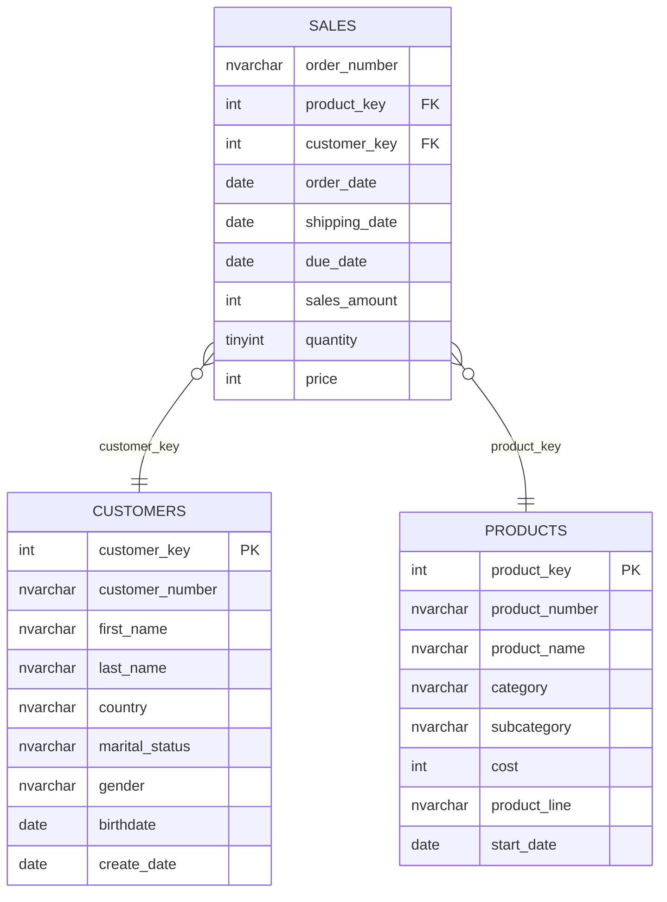

# Data Analysis with SQL

**End-to-end SQL analytics project on a star-schema data warehouse: from raw exploration to reusable customer and product reporting views.**

Built with **SQL Server (T-SQL)** | 18K+ customers | 60K sales lines | 295 products | ~€29M revenue analysed

---

## Table of Contents

- [Business Problem](#business-problem)
- [Data Model](#data-model)
- [Project Structure](#project-structure)
- [Analytical Workflow](#analytical-workflow)
- [Reporting Views](#reporting-views)
- [Key Findings](#key-findings)
- [Presentation](#presentation)
- [Skills Demonstrated](#skills-demonstrated)
- [How to Run](#how-to-run)
- [Data Quality Notes](#data-quality-notes)

---

## Business Problem

A bike retailer sells bikes, accessories and clothing across six countries. Leadership wants to know:

1. **Who are our customers**, and which of them drive revenue?
2. **Which products and categories** perform, and which do not?
3. **How has the business changed over time**, and where is the growth coming from?
4. **What should we do next** to grow revenue and retention?

This project answers those questions with SQL only, moving from basic exploration to production-style reporting views that BI tools (Power BI, Tableau) can connect to directly.

## Data Model

The warehouse follows a **star schema** in a `gold` schema (analytics-ready layer).



| Table | Grain | Rows |
|---|---|---|
| `sales` | One row per order line | ~60,400 |
| `customers` | One row per customer | ~18,500 |
| `products` | One row per product | 295 |

## Project Structure

```
sql-data-warehouse-analytics/
├── datasets/
│   ├── customers.csv            # customers source
│   ├── products.csv             # products source
│   └── sales.csv                # sales source
├── scripts/
│   ├── 00_init_database.sql             # Create DB, schema, tables, bulk load
│   ├── 01_database_exploration.sql      # Tables and column metadata
│   ├── 02_dimensions_exploration.sql    # Countries, categories, products
│   ├── 03_date_range_exploration.sql    # Time boundaries, customer ages
│   ├── 04_measures_exploration.sql      # Headline KPIs
│   ├── 05_magnitude_analysis.sql        # Totals by dimension
│   ├── 06_ranking_analysis.sql          # Top/bottom products and customers
│   ├── 07_change_over_time_analysis.sql # Monthly trends
│   ├── 08_cumulative_analysis.sql       # Running totals, moving averages
│   ├── 09_performance_analysis.sql      # Year-over-year, vs. average
│   ├── 10_data_segmentation.sql         # Cost bands, customer segments
│   ├── 11_part_to_whole_analysis.sql    # Category contribution
│   ├── 12_report_customers.sql          # View: gold.report_customers
│   └── 13_report_products.sql           # View: gold.report_products
├── reports/
│   ├── customers_report.csv     # Export of gold.report_customers
│   ├── products_report.csv      # Export of gold.report_products
│   └── Customer_Product_Insights_Report   # Written findings
├── presentation/
│   └── Business_presentation.pptx   # Executive deck (created with Gamma)
└── README.md
```

## Analytical Workflow

The scripts follow a structured path used in real analytics engagements: **understand the data, measure it, then explain it.**

| Phase | Script(s) | Question answered | Techniques |
|---|---|---|---|
| **1. Explore** | 01-03 | What is in the warehouse? What period does it cover? | `INFORMATION_SCHEMA`, `DISTINCT`, `MIN/MAX`, `DATEDIFF` |
| **2. Measure** | 04 | What are the headline numbers? | `SUM`, `AVG`, `COUNT DISTINCT`, `UNION ALL` KPI table |
| **3. Magnitude** | 05 | How is revenue/customers distributed across countries, categories, genders? | `GROUP BY`, `LEFT JOIN` across the star schema |
| **4. Rank** | 06 | Who are the top/bottom products and customers? | `TOP`, `RANK() OVER` |
| **5. Trend** | 07-08 | How is the business changing? What is the running total? | `DATETRUNC`, `FORMAT`, `SUM() OVER`, moving average |
| **6. Performance** | 09 | Is each product above or below its own average and last year? | CTEs, `LAG()`, `AVG() OVER (PARTITION BY)`, `CASE` |
| **7. Segment** | 10 | Which customers are VIP / Regular / New? How are products priced? | `CASE` segmentation, subqueries |
| **8. Part-to-whole** | 11 | Which categories drive the total? | Window `SUM() OVER ()`, percentage of total |
| **9. Productionise** | 12-13 | Can this be reused by a BI tool? | `CREATE VIEW`, layered CTEs, null-safe KPIs |

## Reporting Views

The final two scripts consolidate the analysis into **reusable views** in the `gold` schema.

### `report_customers`

One row per customer, built in three layers (base query, aggregation, KPI calculation).

- **Attributes:** name, customer number, age, age group
- **Segment:** VIP (12+ months, spend > €5,000), Regular (12+ months, ≤ €5,000), New (< 12 months)
- **Metrics:** total orders, sales, quantity, products, last order date, lifespan (months)
- **KPIs:** recency, average order value, average monthly spend

### `report_products`

One row per product, using the same layered pattern.

- **Attributes:** name, category, subcategory, cost
- **Segment:** High-Performer (> €50K), Mid-Range (€10K-€50K), Low-Performer
- **Metrics:** total orders, sales, quantity, unique customers, lifespan
- **KPIs:** recency, average selling price, average order revenue, average monthly revenue

Both views guard against division by zero (`CASE WHEN ... = 0`, `NULLIF`) and exclude rows with missing order dates.

## Key Findings

| Area | Insight |
|---|---|
| **Scale** | €29.35M revenue, 27,657 orders, 18,482 buying customers, 130 active products |
| **Revenue mix** | Bikes generate **96.5%** of revenue; Accessories (2.4%) and Clothing (1.2%) are small in value but large in units |
| **Product concentration** | Top 10 products = 42.5% of revenue; 66 High-Performers = 94% of revenue; 6 Low-Performers earn almost nothing |
| **Customer value** | VIPs are 8.9% of customers but **36.7% of revenue** (avg. spend €6,510 vs. €758 for "New") |
| **Retention gap** | **63%** of customers bought only once; the repeat 37% drive **77%** of revenue |
| **Geography** | Australia has 19% of customers but 31% of revenue; average spend is ~2x the US, and 1 in 5 Australian customers is a VIP |
| **Growth** | Revenue grew **2.8x in 2013** as accessories and clothing launched and new-customer acquisition quadrupled |
| **Margins** | Estimated margin: Accessories ~63%, Clothing ~45%, Bikes ~39% |

The full write-up with tables, recommendations and data caveats is in `docs/`.

### Recommendations that follow from the analysis

1. Launch a second-purchase programme to convert one-time buyers.
2. Use high-margin accessories as the retention hook and bundle them with bike orders.
3. Test the Australian approach in the US and Canada, where VIP share is lowest.
4. Protect availability of the Mountain-200 and Road-150 families.
5. Rationalise low-performing products and review thin-margin items.

## Presentation

An executive-style slide deck summarises the analysis for a non-technical audience: business problem, headline KPIs, customer and product insights, and recommendations.

**[View the presentation on Gamma](https://gamma.app/docs/ut0yyeu6s73xiq9)** | [Download the .pptx](presentation/Business_presentation.pptx)

## Skills Demonstrated

- **Data modelling:** star schema, fact and dimension tables, surrogate keys
- **Advanced T-SQL:** CTEs, window functions (`RANK`, `LAG`, `SUM/AVG OVER`), `CASE`, subqueries, date functions
- **Analytical thinking:** KPI design, segmentation logic, YoY and part-to-whole analysis
- **Engineering practice:** idempotent scripts (`IF EXISTS ... DROP`), documented headers, numbered execution order, reusable views for BI
- **Business communication:** translating query results into insights, a written report and an executive slide deck

## How to Run

**Prerequisites:** SQL Server (2022 or later for `DATETRUNC`) and SSMS or Azure Data Studio.

1. Clone the repository and place the CSVs where the load script expects them, or update the paths in `init_database.sql`:
   ```sql
   BULK INSERT gold.dim_customers
   FROM 'C:\sql\sql-project\datasets\customers.csv'
   ```
2. Run `init_database.sql`. **Warning:** it drops and recreates the `DataWarehouseAnalytics` database.
3. Run scripts `01` to `11` in order to reproduce the analysis.
4. Run `report_customers.sql` and `report_products.sql` to create the views, then query them:
   ```sql
   SELECT TOP 10 * FROM customers ORDER BY total_sales DESC;
   SELECT * FROM products WHERE product_segment = 'Low-Performer';
   ```

## Data Quality Notes 

- One thing I realized later is that recency turned out to be not accurate because I measured against the day (GETDATE()) I ran the queries (about 137 months), So should have used the date when the data ends in January 2014. 
- 17 customers have no birthdate.
- 2010 (Dec only) and 2014 (Jan only) should not be used in year-on-year comparisons; 19 order rows have no order date and are excluded from the reports.

## Author
 
**Mohammed Adnan**\
Data Analyst
